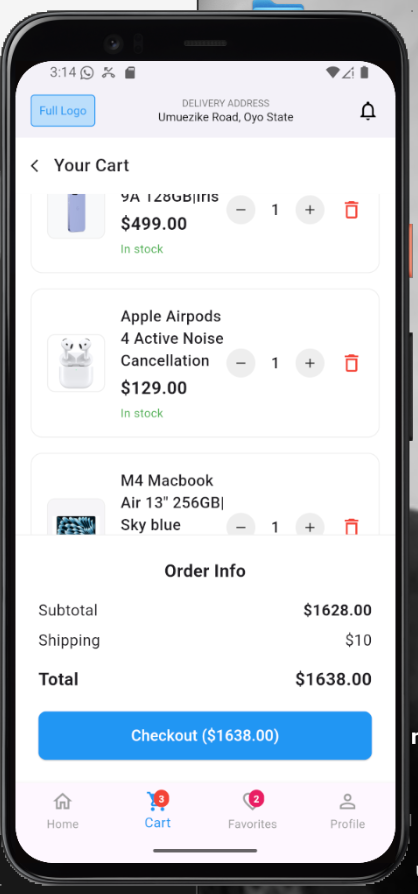

# 🛍️ Flutter E-commerce App

A modern, feature-rich e-commerce mobile application built with Flutter, showcasing clean architecture, smooth animations, and intuitive user experience.

## 📱 Features

### 🏠 **Core Functionality**

* **Product Browsing** : Grid layout with smooth scrolling
* **Product Details** : Detailed product view with Hero animations
* **Shopping Cart** : Add/remove items with quantity management
* **Smart Cart Logic** : Prevents duplicate items, toggles add/remove
* **Real-time Updates** : Instant cart badge and button state updates
* **Custom Toasts** : Beautiful top-positioned notifications
* **Bottom Navigation** : Seamless navigation between sections

### 🎨 **User Experience**

* **Hero Animations** : Smooth product image transitions
* **Instant Feedback** : Real-time UI updates without navigation delays
* **Professional UI** : Clean, modern design following material guidelines
* **Responsive Design** : Optimized for different screen sizes
* **Error Handling** : Graceful fallbacks for missing assets

### 🛒 **Shopping Flow**

```
Home → Product Grid → Product Detail → Add/Remove from Cart → Cart Management
```

## 🏗️ **Architecture**

### **State Management** : InheritedWidget

* Centralized cart state management
* Automatic UI rebuilds on state changes
* Clean separation of concerns
* No external dependencies

### **Project Structure**

```
lib/
├── main.dart                     # App entry point
├── models/                       # Data models
│   ├── product.dart             # Product model
│   └── cart_item.dart           # Cart item model
├── providers/                    # State management
│   └── cart_provider.dart       # InheritedWidget implementation
├── data/                         # Static data
│   └── sample_data.dart         # Product catalog
├── screens/                      # App screens
│   ├── main_screen.dart         # Bottom navigation wrapper
│   ├── home_screen.dart         # Product listing
│   ├── product_detail_screen.dart # Product details
│   └── cart_screen.dart         # Shopping cart
├── widgets/                      # Reusable components
│   ├── common/
│   │   └── custom_app_bar.dart  # Consistent app bar
│   ├── product/
│   │   └── product_card.dart    # Product grid item
│   └── cart/
│       └── cart_item_widget.dart # Cart item component
├── utils/                        # App utilities
│   ├── constants.dart           # App constants
│   ├── colors.dart             # Color scheme
│   └── text_styles.dart        # Typography
└── services/                     # Business logic
    └── cart_service.dart        # Future API integration
```

## 🚀 **Quick Start**

### **Prerequisites**

* Flutter SDK (>=3.0.0)
* Dart SDK (>=2.17.0)
* iOS Simulator / Android Emulator / Physical Device

### **Installation**

1. **Clone the repository:**
   ```bash
   git clone https://github.com/angeloobeta/flutter_ecommerce_app.git
   cd flutter_ecommerce_app
   ```
2. **Install dependencies:**
   ```bash
   flutter pub get
   ```
3. **Run the app:**
   ```bash
   flutter run
   ```

> 📱  **Note** : The project includes sample product images in `assets/images/products/` and app screenshots in `screenshots/` ready to use!

## 📸 **Screenshots**

<div align="center">
### 🏠 Home Screen


*Product grid with search functionality and clean navigation*

### 📱 Product Detail


*Large product view with Hero animation and smart add/remove button*

### 🛒 Shopping Cart


*Cart management with quantity controls and order summary*

### 🔔 Custom Toast Notifications


*Top-positioned dismissible notifications for user feedback*

### 🎬 Hero Animation Demo


*Smooth product image transitions between screens*

</div>
### **App Flow Overview


### **App Flow Overview**

| Home Screen                                              | Product Detail                                              | Cart Screen                                              |
| -------------------------------------------------------- | ----------------------------------------------------------- | -------------------------------------------------------- |
| `` | `` | `` |
| Browse products in grid layout                           | View product details with animations                        | Manage cart items and checkout                           |

### **Key Features in Action**

<table>
  <tr>
    <td align="center">
      
      <br />
      <strong>Product Grid</strong>
      <br />
      Clean layout with search
    </td>
    <td align="center">
      
      <br />
      <strong>Smart Notifications</strong>
      <br />
      Top-positioned toasts
    </td>
    <td align="center">
      
      <br />
      <strong>Smooth Animations</strong>
      <br />
      Hero transitions
    </td>
  </tr>
</table>
## 🎯 **Key Implementation Details**

### **Smart Cart Management**

```dart
// Prevents duplicate items
bool isProductInCart(String productId) {
  return _cartItems.any((item) => item.product.id == productId);
}

// Adds only if not already in cart
void addToCart(Product product) {
  if (!isProductInCart(product.id)) {
    setState(() {
      _cartItems.add(CartItem(product: product));
    });
  }
}
```

### **Hero Animations**

```dart
// Smooth transitions between screens
Hero(
  tag: 'product-${product.id}',
  child: Image.asset(product.image),
)
```

### **Custom Toast Notifications**

```dart
// Top-positioned custom overlay
OverlayEntry(
  builder: (context) => Positioned(
    top: 50,
    left: 16,
    right: 16,
    child: CustomToastWidget(),
  ),
)
```

### **Real-time Cart Badge**

```dart
// Instant updates without navigation
if (cart?.totalItems != null && cart!.totalItems > 0)
  Positioned(
    child: Container(
      child: Text('${cart.totalItems}'),
    ),
  ),
```

## 🛠️ **Technology Stack**

* **Framework** : Flutter 3.0+
* **Language** : Dart 2.17+
* **State Management** : InheritedWidget
* **Architecture** : Clean Architecture
* **UI** : Material Design
* **Animations** : Hero & Custom animations
* **Assets** : Local image assets
* **Testing** : Unit & Widget tests included

## 📦 **Dependencies**

```yaml
dependencies:
  flutter:
    sdk: flutter
  cupertino_icons: ^1.0.2

dev_dependencies:
  flutter_test:
    sdk: flutter
  flutter_lints: ^3.0.0
```

*No external state management dependencies - pure Flutter implementation!*

## 🔧 **Configuration**

### **Adding New Products**

Edit `lib/data/sample_data.dart`:

```dart
Product(
  id: 'unique_id',
  name: 'Product Name',
  price: 99.99,
  image: 'assets/images/products/your_image.png',
  description: 'Product description...',
)
```

*Note: Add corresponding product images to `assets/images/products/` folder*

## 📷 **Adding Screenshots**

To add your app screenshots to the README:

1. **Create screenshots folder:**
   ```bash
   mkdir screenshots
   ```
2. **Take screenshots of your app and save them as:**
   * `screenshots/home_screen.png` - Home screen with product grid
   * `screenshots/product_detail.png` - Product detail view
   * `screenshots/cart_screen.png` - Shopping cart screen
   * `screenshots/toast_notification.png` - Toast notification example
   * `screenshots/hero_animation.png` - Hero animation demo (optional)
3. **Recommended screenshot specifications:**
   * **Format** : PNG for static images, GIF for animations
   * **Size** : 750x1334 (iPhone) or 1080x1920 (Android)
   * **Quality** : High resolution for clarity
   * **Content** : Show key features and user interactions
4. **Tools for taking screenshots:**
   * **iOS Simulator** : `Cmd + S` or Device > Screenshot
   * **Android Emulator** : Screenshot button in toolbar
   * **Physical Device** : Power + Volume Down (Android) or Power + Home (iOS)
   * **For GIFs** : Use tools like [LICEcap](https://www.cockos.com/licecap/) or [GIPHY Capture](https://giphy.com/apps/giphycapture)
5. **Optimize for GitHub:**
   * Keep image files under 25MB (GitHub limit)
   * Compress images without losing quality
   * Use descriptive filenames
   * Consider using a separate `docs/` folder for larger files

**Expected file structure:**

```
flutter_ecommerce_app/
├── screenshots/
│   ├── home_screen.png
│   ├── product_detail.png
│   ├── cart_screen.png
│   ├── toast_notification.png
│   └── hero_animation.gif
├── assets/
│   └── images/
│       └── products/
└── lib/
```

### **Customizing Colors**

Edit `lib/utils/colors.dart`:

```dart
class AppColors {
  static const Color primary = Colors.blue;
  static const Color accent = Colors.green;
  // ... more colors
}
```

### **Updating Text Styles**

Edit `lib/utils/text_styles.dart`:

```dart
class AppTextStyles {
  static const TextStyle h1 = TextStyle(
    fontSize: 24,
    fontWeight: FontWeight.bold,
  );
  // ... more styles
}
```

## 📋 **Features Checklist**

* ✅ Product browsing with grid layout
* ✅ Product detail view with Hero animations
* ✅ Smart cart management (no duplicates)
* ✅ Add/remove from cart with instant feedback
* ✅ Real-time cart badge updates
* ✅ Custom top-positioned toast notifications
* ✅ Bottom navigation with persistent state
* ✅ Quantity management in cart
* ✅ Order summary with shipping calculation
* ✅ Error handling for missing images
* ✅ Responsive design
* ✅ Clean architecture
* ✅ Comprehensive testing structure

## 🧪 **Testing**

```bash
# Run all tests
flutter test

# Run specific test categories
flutter test test/unit_tests/
flutter test test/widget_tests/
flutter test test/integration_tests/
```

### **Test Structure**

```
test/
├── unit_tests/
│   ├── models/
│   ├── providers/
│   └── services/
├── widget_tests/
│   ├── screens/
│   └── widgets/
└── integration_tests/
    └── app_test.dart
```

## 🚀 **Building for Production**

### **Android**

```bash
flutter build apk --release
# or
flutter build appbundle --release
```

### **iOS**

```bash
flutter build ios --release
```

### **Web**

```bash
flutter build web --release
```

## 📈 **Performance Optimizations**

* **Efficient State Management** : InheritedWidget minimizes rebuilds
* **Image Optimization** : Proper asset loading with error handling
* **Memory Management** : Efficient cart operations
* **Smooth Animations** : Hardware-accelerated Hero transitions
* **Minimal Dependencies** : Lightweight app with fast startup

## 🤝 **Contributing**

1. **Fork the repository**
2. **Create a feature branch:**
   ```bash
   git checkout -b feature/amazing-feature
   ```
3. **Commit your changes:**
   ```bash
   git commit -m 'Add some amazing feature'
   ```
4. **Push to the branch:**
   ```bash
   git push origin feature/amazing-feature
   ```
5. **Open a Pull Request**

### **Contribution Guidelines**

* Follow the existing code style
* Add tests for new features
* Update documentation as needed
* Ensure all tests pass before submitting

## 📄 **License**

This project is licensed under the MIT License - see the [LICENSE](https://claude.ai/chat/LICENSE) file for details.

```
MIT License

Copyright (c) 2024 Flutter E-commerce App

Permission is hereby granted, free of charge, to any person obtaining a copy
of this software and associated documentation files (the "Software"), to deal
in the Software without restriction, including without limitation the rights
to use, copy, modify, merge, publish, distribute, sublicense, and/or sell
copies of the Software, and to permit persons to whom the Software is
furnished to do so, subject to the following conditions:

The above copyright notice and this permission notice shall be included in all
copies or substantial portions of the Software.

THE SOFTWARE IS PROVIDED "AS IS", WITHOUT WARRANTY OF ANY KIND, EXPRESS OR
IMPLIED, INCLUDING BUT NOT LIMITED TO THE WARRANTIES OF MERCHANTABILITY,
FITNESS FOR A PARTICULAR PURPOSE AND NONINFRINGEMENT. IN NO EVENT SHALL THE
AUTHORS OR COPYRIGHT HOLDERS BE LIABLE FOR ANY CLAIM, DAMAGES OR OTHER
LIABILITY, WHETHER IN AN ACTION OF CONTRACT, TORT OR OTHERWISE, ARISING FROM,
OUT OF OR IN CONNECTION WITH THE SOFTWARE OR THE USE OR OTHER DEALINGS IN THE
SOFTWARE.
```

## 🙏 **Acknowledgments**

* **Flutter Team** for the amazing framework
* **Material Design** for the design guidelines
* **Community Contributors** for inspiration and best practices

## 📞 **Support**

If you encounter any issues or have questions:

1. **Check the Issues** section for existing solutions
2. **Create a new Issue** with detailed information
3. **Join the Discussion** for general questions
4. **Review the Documentation** for implementation details

---

**Happy Shopping! 🛍️**

*Built with ❤️ using Flutter*
